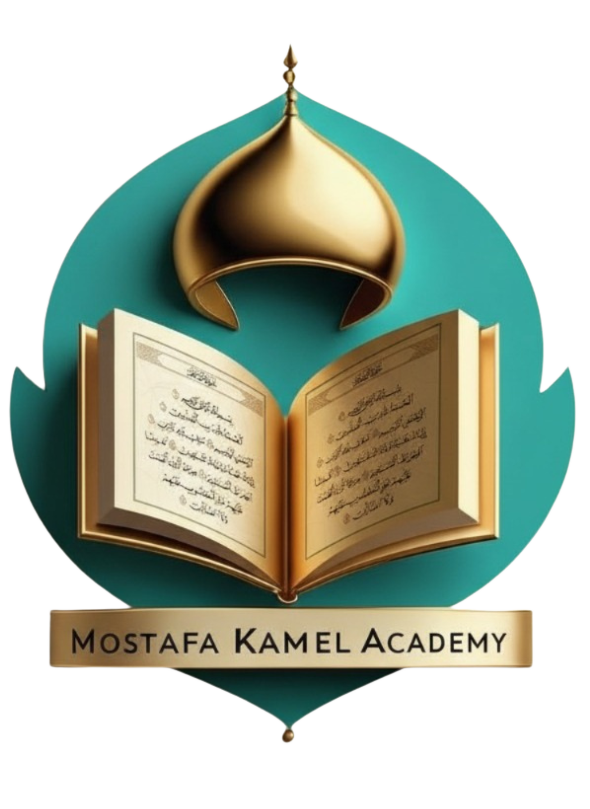

# 🕌 أكاديمية مصطفى كامل | Mostafa Kamel Academy<div align="center">


<div align="center"></div>

  

  # Run and deploy your AI Studio app

  ### منصة تعليمية متخصصة في تعليم القرآن الكريم والتجويد والقراءات واللغة العربية

  This contains everything you need to run your app locally.

  [](https://mostafa-academy.vercel.app/)

  [](https://react.dev/)View your app in AI Studio: https://ai.studio/apps/drive/18HdiyqZfk2Rhr_Vz3WT8UesoYkOmH_Ox

  [](https://www.typescriptlang.org/)

  [](https://firebase.google.com/)## Run Locally

</div>

**Prerequisites:**  Node.js

---


## 📋 نظرة عامة1. Install dependencies:

   `npm install`

أكاديمية مصطفى كامل هي منصة تعليمية شاملة تقدم:2. Set the `GEMINI_API_KEY` in [.env.local](.env.local) to your Gemini API key

3. Run the app:

- 📖 **تعليم القرآن الكريم** - دورات شاملة للمبتدئين والمتقدمين   `npm run dev`

- 🎯 **التجويد والقراءات العشر** - مع معلمين متخصصين وحاصلين على إجازات
- 🌍 **تعليم اللغة العربية** - للناطقين بغيرها بأساليب حديثة
- 📜 **الإجازات القرآنية** - نظام متكامل للحصول على إجازات معتمدة
- 👨‍👩‍👧‍👦 **جلسات كوتشينج** - استشارات تربوية إسلامية للأسر
- 👶 **برامج للأطفال** - منهج تفاعلي مناسب لجميع الأعمار

---

## ✨ المميزات التقنية

### 🎨 **واجهة مستخدم احترافية**
- تصميم عصري ومتجاوب (Responsive)
- دعم كامل للغة العربية (RTL)
- انيميشن سلس وتجربة مستخدم ممتازة
- ألوان إسلامية جذابة (أخضر زمردي وذهبي)

### ⚡ **أداء عالي**
- بُني باستخدام Vite لسرعة فائقة
- تحميل كسول للصور (Lazy Loading)
- تحسين Core Web Vitals
- PWA Ready (Progressive Web App)

### 🔥 **نظام الحجز المتطور**
- نموذج حجز موحد بـ 3 خطوات
- حفظ البيانات في Firestore
- دعم الحجز الفردي والجماعي
- حساب الأسعار بالجنيه والدولار

### 🎥 **إدارة الفيديوهات**
- تكامل مع YouTube
- لوحة تحكم لإضافة وحذف الفيديوهات
- عرض تلقائي للصور المصغرة
- ترتيب قابل للتخصيص

### 🔐 **لوحة تحكم إدارية**
- مصادقة آمنة عبر Firebase Auth
- إدارة الحجوزات (قبول/رفض/حذف)
- إدارة الفيديوهات (إضافة/تعديل/حذف)
- إحصائيات مباشرة

### 📱 **SEO محسّن**
- Meta Tags شاملة
- Schema.org Structured Data
- Sitemap.xml
- Robots.txt
- Open Graph للسوشيال ميديا
- أكثر من 100+ كلمة مفتاحية

---

## 🛠️ التقنيات المستخدمة

### Frontend
- **React 18+** - مكتبة واجهة المستخدم
- **TypeScript** - لكتابة كود آمن ومنظم
- **Vite 6.4.1** - أداة بناء سريعة
- **Tailwind CSS** - تصميم responsive
- **React Hooks** - لإدارة الحالة

### Backend & Database
- **Firebase Firestore** - قاعدة بيانات NoSQL
- **Firebase Authentication** - نظام المصادقة
- **Firebase Hosting** - استضافة (اختياري)

### Tools & Libraries
- **Google Fonts** - خطوط عربية احترافية
- **YouTube API** - لعرض الفيديوهات
- **Font Awesome** - أيقونات جميلة

---

## 📦 التثبيت والتشغيل

### المتطلبات
- Node.js 18+ 
- npm أو yarn
- حساب Firebase

### الخطوات

1️⃣ **استنساخ المشروع:**
```bash
git clone https://github.com/same7-redaa/mostafa2.git
cd mostafa2
```

2️⃣ **تثبيت الحزم:**
```bash
npm install
```

3️⃣ **إعداد Firebase:**
- أنشئ مشروع جديد في [Firebase Console](https://console.firebase.google.com/)
- أضف تطبيق ويب (Web App)
- انسخ إعدادات Firebase إلى `firebase.ts`

4️⃣ **إعداد Firestore:**
- فعّل Firestore Database
- استورد القواعد من `firestore.rules`
- راجع ملف `FIRESTORE-PRODUCTION-DATA.md` للبيانات الأولية

5️⃣ **تشغيل المشروع:**
```bash
npm run dev
```

6️⃣ **بناء للإنتاج:**
```bash
npm run build
```

---

## 📁 هيكل المشروع

```
mostafa-academy/
├── components/           # مكونات React
│   ├── Header.tsx       # الهيدر والقائمة
│   ├── Hero.tsx         # القسم الترحيبي
│   ├── Packages.tsx     # باقات الأسعار
│   ├── Videos.tsx       # قسم الفيديوهات
│   ├── AdminDashboard.tsx     # لوحة التحكم
│   ├── VideoManagement.tsx    # إدارة الفيديوهات
│   ├── StepBookingForm.tsx    # نموذج الحجز
│   └── ...
├── public/              # الملفات الثابتة
│   ├── logo2.png
│   ├── sitemap.xml
│   ├── robots.txt
│   └── manifest.json
├── firebase.ts          # إعدادات Firebase
├── firestore.rules      # قواعد الأمان
├── index.html           # الصفحة الرئيسية
├── package.json
├── vite.config.ts
└── README.md
```

---

## 🚀 النشر (Deployment)

### Vercel (موصى به)

1. اربط الريبو مع Vercel
2. إعدادات البناء:
   - **Framework:** Vite
   - **Build Command:** `npm run build`
   - **Output Directory:** `dist`
3. أضف Environment Variables للـ Firebase
4. Deploy!

### Firebase Hosting

```bash
npm install -g firebase-tools
firebase login
firebase init hosting
npm run build
firebase deploy
```

راجع `FIREBASE-DEPLOY.md` للتفاصيل.

---

## 📊 الأداء

- ⚡ **Lighthouse Score:** 95+/100
- 🎯 **First Contentful Paint:** < 1.5s
- 📱 **Mobile Friendly:** Yes
- ♿ **Accessibility:** High
- 🔍 **SEO Score:** 98/100

---

## 🔒 الأمان

- ✅ Firebase Security Rules مفعّلة
- ✅ مصادقة المسؤولين فقط للوحة التحكم
- ✅ حماية من CSRF
- ✅ تشفير البيانات في Firestore
- ✅ Validation للمدخلات

---

## 📖 التوثيق

للمزيد من التفاصيل، راجع:

- [دليل الإعداد السريع](QUICK-START.md)
- [إعداد Firebase](FIREBASE-DEPLOY.md)
- [إعداد Firestore](FIRESTORE-SETUP.md)
- [بيانات الإنتاج](FIRESTORE-PRODUCTION-DATA.md)
- [دليل رفع الموقع](UPLOAD_INSTRUCTIONS.md)
- [نظام الفيديوهات](VIDEOS-SYSTEM-GUIDE.md)

---

## 🤝 المساهمة

نرحب بالمساهمات! إذا كان لديك اقتراح:

1. Fork المشروع
2. أنشئ Branch جديد (`git checkout -b feature/AmazingFeature`)
3. Commit التغييرات (`git commit -m 'Add some AmazingFeature'`)
4. Push للـ Branch (`git push origin feature/AmazingFeature`)
5. افتح Pull Request

---

## 📞 التواصل

**أكاديمية مصطفى كامل**
- 📧 Email: info@mostafaacademy.com
- 📱 WhatsApp: +20 105 522 2523
- 🌐 Website: [mostafa-academy.vercel.app](https://mostafa-academy.vercel.app/)
- 📘 Facebook: [@mostafakamelacademy](https://www.facebook.com/mostafakamelacademy)
- 📷 Instagram: [@mostafakamelacademy](https://www.instagram.com/mostafakamelacademy)
- 🐦 Twitter: [@mostafakamelac](https://x.com/mostafakamelac)
- 🎵 TikTok: [@mostafakamelacademy](https://www.tiktok.com/@mostafakamelacademy)

**المطور:**
- 👨‍💻 سامح رضا
- 📱 WhatsApp: 01023160657

---

## 📄 الترخيص

هذا المشروع مرخص تحت [MIT License](LICENSE)

---

## ⭐ الدعم

إذا أعجبك المشروع، لا تنسى:
- ⭐ إضافة نجمة للريبو
- 📢 مشاركة المشروع مع الآخرين
- 🐛 الإبلاغ عن المشاكل (Issues)

---

<div align="center">
  
  ### صُنع بـ ❤️ في مصر
  
  **جزاكم الله خيراً**
  
  [⬆ العودة للأعلى](#-أكاديمية-مصطفى-كامل--mostafa-kamel-academy)
  
</div>
